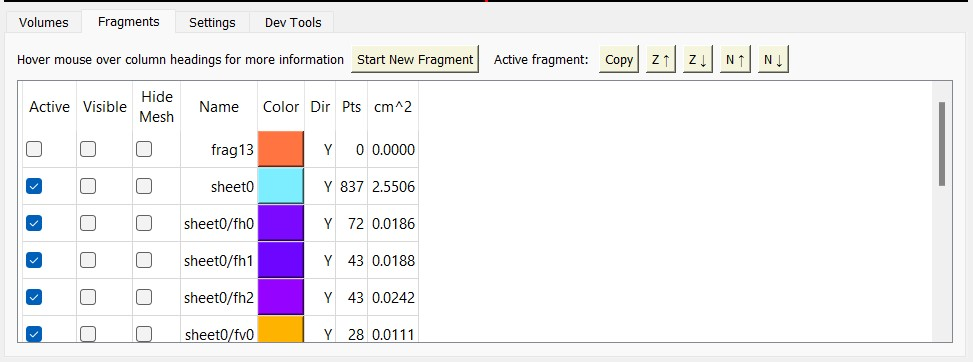
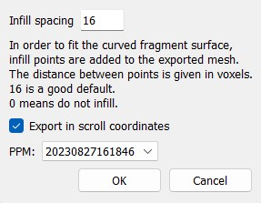
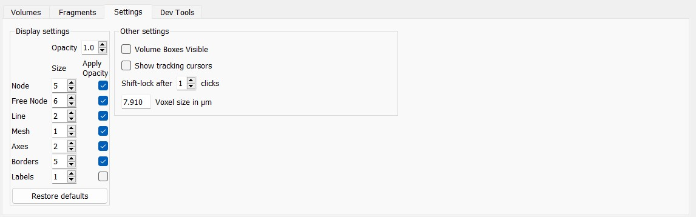

# khartes

Khartes (from χάρτης, an ancient Greek word for scroll) is a program
that allows users to interactively explore, and then segment,
the data volumes created by high-resolution X-ray tomography of the Herculaneum scrolls.

Khartes is written in Python; it uses PyQt5 for the user interface, numpy and scipy for efficient computations,
pynrrd to read and write NRRD files (a data format for volume files), and OpenCV for graphics operations.

The main emphasis of khartes is on interactivity and a user-friendly GUI; no computer-vision or machine-learning
algorithms are currently used.

### 2-minute video

The video below gives a quick, 2-minute overview of khartes.

(If you click on the image below, you will be taken to vimeo.com to watch the video)

[](https://vimeo.com/849799186)

### 30-minute video

This next video provides a more extensive introduction to khartes.
Note that it begins with a 60-second
intro sequence which contains no narration, but which quickly highlights some of khartes' features.
After the intro, the video follows a more traditional format, with a voice-over and a demo.
The entire video is about 30 minutes long.  There is no closed captioning, but the script for the video
can be found in the file demo1_script.txt.

(If you click on the image below, you will be taken to vimeo.com to watch the video)

[](https://vimeo.com/827515595)

## Installation

You should be able to run khartes simply by
cloning the repository, making sure you have the proper dependencies
(see [anaconda_installation.txt](anaconda_installation.txt) for a list), and then typing `python khartes.py`.

When khartes starts, it displays some explanatory text on the right-hand side of the interface
to help you get started.  This text is fairly limited; you might want to watch the videos above to get a better
idea how to proceed, and read the Manual/Tutorial below.

## Manual/Tutorial

Ideally, khartes should come with both a user manual and a tutorial (and perhaps even a "cookbook"),
but at this point there exists only a single document, the one you are now reading:
a tutorial that also tries to act as a user manual of sorts.

This tutorial covers the following steps:
* Creating a project
* Creating a data volume from TIFF files
* Exploring the user interface and the data volume
* Creating and editing a fragment ("segmentation")
* General workflow for creating coherent, consistent fragments
* Working with multiple fragments
* Importing meshes (`.obj` files), and exporting fragments as meshes
* Setting display parameters

### Creating a project

If you are running khartes for the first time, or
if you are starting a new project, select the `File / New Project...` menu item
to create a new project.  When you create a new project, you will
immediately be asked for the name of your project, and the location
on disk where you wish it to be created.  This is so that khartes
can begin to store data there,
which it does even before the first time you invoke "Save".

### Converting TIFF files to khartes data volumes

In order to perform at interactive speeds, khartes works with data
volumes (3D volumes of data) rather than individual TIFF files.
To facilitate this,
khartes provides an interface to a data volume from a set of TIFF files.
It is assumed that the TIFF files are located somewhere in your file system;
khartes does not download TIFF files over the internet.

The `File / Create volume from TIFF files...` menu item brings up a dialog box where
you can specify the TIFF files you want to include in your
data volume, as well as the x and y ranges of the pixels within the TIFF images.
A status bar at the bottom of the dialog box shows how large the
resulting data volume will be in gigabytes.
**Be aware that every time you run khartes, the entire
data volume will be read into the physical memory (RAM) of your
computer, so be careful how large you make the volume.**

The first step, of course, is to find your TIFF files.
If your TIFF files are in a `.volpkg` directory, you can
find them under the `volumes` sub-directory.
Use the file selector in the TIFF loader dialog box to locate
the *directory* that contains all the TIFF files.  Once
you double-click on the *directory* name (not on the
individual TIFF files inside that directory), the TIFF loader
will read the TIFF files, determine how many
there are and their x and y extent (width and height).

Be aware that the TIFF loader assumes that the TIFF files are
consecutively numbered (no gaps), and that they all have the
same width and height.

The TIFF loader will display the maximum possible range of the
volume that you can create from the TIFF files, which in most
cases would vastly exceed the memory (RAM) of your computer.

By adjusting these numbers in the TIFF loader dialog box,
you can specify the `Min` (minimum)
and `Max` (maximum) x, y and z (TIFF file)
values for the data volume you want to create.

You can also specify a `Step`, which is the step
size (distance) between the pixels that will be imported from the original
image.  One way to
think of `Step` is as a decimation factor.  A step
of 1 means use every pixel, 2 means use every second pixel,
and so on.  Choosing a higher step size reduces the
size of the data volume over a given range,
but the loss of resolution, even going from a step size
of 1 to 2, is quite noticeable when you try to
segment the data.

The main use of `Step` is to allow an
overview of the data, in order to determine which areas will
merit a closer examination later at a higher resolution.  For instance,
if you set a step size of 10 in all three directions (x, y, and z),
you can reduce an entire scroll, typically 1.5 Tb or so,
to a very manageable 1.5 Gb.  The resolution of such a volume
is much too low for segmentation, but it is good enough to give you
an idea of where the interesting areas of the scroll are.

**As the first step of this tutorial**, create a data volume that
encompasses your entire set of TIFF files.  Use a `Step` of 10
in all three directions, in order to keep the data volume small.

Name this new volume `all10`, to remind yourself that the volume
encompasses all the data, but with a decimation factor of 10.
Set the color to something you like.

When you press the `Create` button, if you get a warning that your
data volume will be large, check to make sure that all three `Step`
values are set to 10.

This process will take a significant fraction of an hour, depending on
how fast your computer is, and how many TIFF files are in your dataset.
For instance, if your scroll is made up of 14,000 TIFF files, and you have set
a step size of 10, khartes will need to read 1,400 of these files.

The TIFF file loader has a status bar at the bottom that shows
the name of the TIFF file that is currently being read.

For future reference: if you already have an `all10` data volume,
typically stored in a file called `all10.nrrd`, you can use the
`File / Import NRRDs...` menu item to import this file, which
is quite a bit faster than reading all those TIFFs.

### Exploring the user interface


Now that you have loaded a data set, you can more easily explore the
user interface of khartes.

Referring to the figure above, the main areas where you will work are the three *Data Slices*
on the left side, and the *Fragment View* in the upper right.
The *Control Area* in the lower right has tabs that let you
make adjustments to volumes, fragments, and display parameters.
At the very bottom is the *Status Bar*, which reports the 3D coordinates
of the cursor.  And at the top is the *Menu*, which handles file import and export.

At the moment, your *Fragment View* is blank, because you have not yet created
any fragments.

Instead, focus on the three Data Slices.  These three windows represent three mutually
perpendicular slices through the 3D data volume.  The three slices meet in the
middle of each window, where the crosshairs intersect.

#### Staying oriented

There are a few cues to help you stay oriented.

1) In the upper left of each data
window is a label (text) that gives the current position of the given slice.
For instance, the upper slice, which corresponds to one of the original TIFF files,
has a text label in the upper left indicating which image (TIFF file) it is from.

2) Below the three Data Slices is the Status Bar.  This displays the current
3D location of the cursor.  For instance, if you move the cursor around inside of the
top Data Slice, and watch the Status Bar, you will see that the IMG (image) coordinate
remains constant (and is the same as in the label in the data slice), while
the X and Y coordinates change.

3) Each of the three Data Slices has a colored border.  And inside each Data Slice, the
two intersecting crosshairs are of different colors.  These colors act as an additional orientation
cue.  Think, for a moment, about the red data slice (the one with a red border).  Somewhere in 3D
space its plane intersects the plane of the green data slice.  These two planes are mutually
perpendicular, so the intersection is a line.  In the window of the red data slice, this
line of intersection is drawn in green; it is in fact the green crosshair, showing that this is where
the green slice crosses the red slice.  Likewise, in the window of the green data slice, this
same intersection line is drawn in red, so that when you are looking at the green window,
you know where the red slice crosses it.

#### Navigation by mouse

To navigate within the data volume, simply hold down the left mouse button while inside one
of the Data Slice windows, and drag the slice.  The two other slices will also change, to ensure that
the mutual intersection point of the three slices remains in the middle of the crosshairs
of all three slices.

You can use the mouse scroll wheel while in any of the Data Slice windows to zoom in or out.
The crosshairs are always the center of the zoom; the mutual intersection point of the three
slice planes does not change during zooming.

#### Navigation by keyboard

You can use the four arrow keys to move the current slice (the one where the mouse cursor is
currently located).  As when navigating with the mouse, the other slices will change to ensure
that their mutual intersection point remains in the centers of all three pairs of crosshairs.

You can also use the page-up and page-down keys to increment or decrement the slice in the current
window.  To see this, watch the text label in the upper left corner of the current Data Slice, and see
how this changes as you press page-up and page-down.

If your keyboard offers auto-repeat, you can hold down an arrow key, or a page-up/down key, and
watch as the current slice slowly moves in the indicated direction.

The `a`, `s`, `w`, and `d` keys behave the same as the arrow keys, and `e` and `c` behave the
same as the page-up/down keys.

#### Getting a feel for 3D navigation

To fully explain the relative orientations of the three slices, and how to navigate
through them, would require many diagrams
that I haven't had time to draw yet.  So for now, try to get a feeling for how the navigation works by
dragging slices, observing the labels in the upper left of each slice, and observing how the 3D
coordinates in the status bar change.

Your goal is to understand the navigation well enough so that you can predict, when you drag
one of the slices around, how the other slices and their labels will behave.  Once you reach
that stage, you will be able to navigate within your 3D data volume with confidence.

### Creating a high-resolution data volume from TIFFs


If you have been following this tutorial exactly, you have created,
and have been navigating within, a data volume that
contains the entire scroll, but at very low resolution.

Now you will create a high-resolution data volume that covers a much
smaller volume.

To begin, bring up the TIFF loader dialog by selecting the
`File / Create volume from TIFF files...` menu item.

The dialog box may still retain the settings that you entered
last time.  This means that you must do the following before proceeding:

**Important step**: Check the `Step` settings in the TIFF loader dialog.
These must all be set to 1, to ensure that you will create a high-resolution
data volume.  If you had previously set the `Step` values to something different, you
must set them all back to 1 now.

Move the TIFF loader box to the side, so you can see the data slices.
Now zoom out, so that you can see your entire data volume (as mentioned
before, this assumes that you are following the tutorial exactly, so that
this data volume is a low-resolution version of the entire scroll).

There should be a box hugging the outside of the data volume, drawn in
the "Volume color" shown in the TIFF loader.

This colored box is interactive; you can drag its corners in order to specify the
volume of interest that you want to load from the TIFF files.

Place your mouse on one of the corners of this box; the cursor should turn into a
diagonal two-way arrow.  Press the
left mouse button and drag the mouse to adjust the position of the corner.
Notice that as you change the position of the corner, the corresponding values
change in the TIFF loader dialog.  Likewise, if you change the numbers in
the TIFF loader dialog, the box will move accordingly.

If, as you adjust the box, it disappears from some of the data slices, you can
find it again by pressing the `Re-center view` button in the TIFF loader.
This will shift the mutual intersection point of the data slices so that they
all pass through the current center of the box.

As you adjust the box, keep an eye on the Gb size that is displayed at the bottom
of the TIFF loader; you want to make sure your data volume will fit in the RAM of
your computer.

Finally, give your volume a name and a color, and hit the `Create` button.
In general, the time the loader takes to run is proportional to the number
of TIFF files that need to be processed.

#### Advanced topic: loading TIFF files from vc_layers

This sub-section is not part of the tutorial, but it belongs with the
current topic: loading TIFF files.

The program `vc_layers` outputs TIFF files that contain the flattened
layers adjacent to a given segment.  These files have a different
orientation than the TIFF files usually read by khartes.  To alert
khartes to this difference, so that the data volume created from these
`vc_layer` TIFFs is properly oriented, put a check mark in the box
labeled `TIFFs are from vc_layers`.

### Control Area: Volumes


Go to the Control Area (the area in the lower right corner of khartes) and select the `Volumes` tab.
Here you should see listed the two volumes you have created so far: all10, and your high-resolution volume.
The checkbox in the left column allows you to select which volume is visible.
The next two columns show the name and the color of each volume.  The name cannot be changed.
However, you can change the volume's color by clicking on the color box.
The volume's color is used when the volume's bounding box is drawn as an overlay
on the data slices.

The 'Ld' column lets you know whether the volume is currently loaded into memory.  By default,
only one volume at a time is present in memory, in order to conserve RAM.  A future version of
khartes may allow multiple volumes to be present in memory simultaneously, in order to
permit the user to switch more quickly among them.

The 'Dir' column allows you to change the display orientation of the volume.  By default, the topmost
data slice window displays each TIFF image in its original orientation, which in khartes is called the Y
orientation.  Using the 'Dir' selector,
you can change the orientation of the TIFF image, turning it on
its side, by selecting the X orientation.  Later on, you will see why this is useful (it has to do with
the fragments being limited to be single-valued surfaces).

Feel free to change the orientation from Y to X to see how the data volume changes appearance in the
data slice windows, but change it back to Y when you are done, since the rest of the tutorial assumes
that you are in the Y orientation.

The next nine columns display the range of the volume within the scroll; these numbers are not editable.

The final column displays the size of the data volume in Gbytes.

Above the list is the `Volume Boxes Visible` checkbox.  When this box is checked, the outlines
(bounding boxes) of all the volumes (except the currently-loaded volume) will be overlaid
on the data slices.

### Creating a fragment (segment)

Now you are ready to create your first fragment ("segment" and "fragment" are used
interchangeably in this tutorial, but khartes prefers "fragment").

In the Control Area, select the Fragments tab.  There you will find
the button `Start New Fragment`.  Press this button, and a new fragment will
appear in the list of fragments.

At this point you can begin adding points (called nodes) to define
the fragment.  To add a node, position the cursor in one of the
Data Slices, hold down the shift key (so the cursor turns into
crosshairs), and press the left mouse button.

It would take a lot of words and pictures to describe the process of adding
nodes to create a fragment; better to watch this 2-minute video (this
is the "2-minute video" mentioned at the top of this README):

[https://vimeo.com/849799186](https://vimeo.com/849799186)

The video shows a slightly older version of khartes; for
instance, the cursor did not turn into crosshairs before a new
node was created, and re-centering the view on an existing node
was more awkward than it is now.

Also, the video does not describe the user's key presses and button
presses.

Here are some general user-interface aspects that you should
have gathered from the video:

* Each node that the user creates is added to a surface (the fragment);
a map view of this surface is displayed in the Fragment View window.
If all the nodes lie in a straight line,
then the Fragment View will display a line rather than a surface.  Once the user creates nodes
in more than one Data Slice, a surface can be created, and
this surface is shown in the Fragment View.

* In each Data Slice, the fragment is drawn as a line; this represents
the intersection between the fragment and the Data Slice.  If any nodes
lie on the plane of the slice, they are shown as red circles.  When
the cursor passes near a node, the node turns from red to cyan.

* The color of the fragment line in the Data Slices, and the color of
the triangular mesh in the Fragment View, match the color of the
fragment, as shown in the Fragments tab in the Control Area.

It is almost time for you to begin creating your own fragment,
but first you need to learn a little about the two user-interaction modes
of khartes.

This topic would preferably be introduced later in the
tutorial, but you need to be alerted to it now, in case you
run into it by accident.

### Normal Mode and Add-Node Mode

Khartes has two modes of user interaction in the data views:
"normal" mode, and "add-node" mode.  In normal mode, the
cursor usually looks like a hand (unless it is near a node), and
to add a node, you need to hold down the shift key, so the cursor
turns into crosshairs, before pressing the left mouse button.

In "add-node" mode, things are reversed.  The cursor always
takes the form of crosshairs, and to add a node, you simply need to
press the left mouse button.

There are two ways to toggle between the two modes.  One way is to
click on the button, to the right of the `Files` menu, that contains
a crosshairs icon. When this button is not selected, khartes is in
normal mode, and when it is selected, khartes is in add-node mode.

The other, more convenient, way to toggle between normal and add-node mode
is to quickly press and release the shift button.  You can see which
mode you are in by seeing whether the cursor afterwards is a hand (normal mode)
or crosshairs (add-node mode).

This topic needed to be introduced now, because you might, by accident,
hit the shift button, unintentionally toggling between modes.
Now that you understand the two modes, you won't be mystified if this happens.

### Choosing a region for segmentation

Before you start creating a fragment, you should make sure that there
is a region in your high-resolution data volume that is possible to segment.

What you are looking for is a region where the papyrus sheets, as
seen in the top Data Slice, are not too tilted (you want an angle
flatter than 45 degrees or so).  This region doesn't have to be very large,
but if you can't find even a small area, then you may need to create
another high-resolution data volume.

### Building and modifying the segment

At this point you are ready to build the segment.
As you saw in the video, you do this by simply adding nodes to the
Data Slices.  Notice that **the order you add nodes does not matter**;
if you feel your nodes are too far apart, simply add more.

But what do you do if you discover that a node is in the wrong
place?  You have a couple of options.

#### Deleting a node

It is very easy to delete a node.  Simply move the cursor over
the node, so that the node turns cyan.
At this point, simply hit the "Delete" or "Backspace" key (either will work).
But bear in mind that **deleting a node will remove it permanently**;
it can not be recovered, as there is currently no undo action implemented.

#### Moving a node

More often, you want to move a node instead of deleting it.  This is likewise
easy to do, assuming you are in "normal mode".  Again, move the cursor to the
node you are interested in moving; the node will turn cyan.  (Notice that
the node will be drawn in cyan in all the data windows where it is visible;
this is often a handy way of keeping track of which node is which in
the different views).

Once the node has turned cyan, there are a couple of ways to move it.

If you are working in a Data Slice, you can now press the left mouse button,
hold it down, and drag the node to where you want it.  Be aware, however, that
you cannot use the mouse to drag nodes in the Fragment View (this is to
prevent accidents).

If you need more precision, you can use the arrow keys (or `a`, `s`, `w`, and `d`)
to move the node to where you want it.  This works in all views, including
the Fragment View.

If you are working in the Fragment View, you can also use the page-up and page-down
keys to move the node.  These keys will move the node perpendicular to the plane of
the Fragment View (to see what this means, make sure your node is also visible in the
top left Data Slice, and see how the node moves in the data slice while you press
page-up or page-down in the Fragment View).

**The key capability of khartes is that as you move nodes, the data image in the
Fragment View updates interactively, so you can instantly judge the quality of
your segmentation.**

#### What the cursor is telling you

As you may have noticed, the cursor often changes its appearance,
depending on where it is in the slice.  The rule is that the shape
of the cursor tells you what will happen when you press the left mouse button.

Here are the various shapes, and what they mean.  Someday I will attach
pictures of the different cursors, and not just describe them in words.

* **Hand**: This indicates that khartes is in "normal mode" (in contrast to
"add-node mode").  If you hold down the left mouse button and drag, the current slice
will slide along with the mouse.

* **Arrow** (pointing upwards and slightly to the left): If you are in a Data Slice or
the Fragment View, this indicates that you are in "normal mode", but more specifically,
that you are near a node (you should see a cyan node nearby).  If you press the left mouse
button and drag, the node will move with the mouse.

* **Semi-transparent hand**: You will only see this if the cursor is in the Fragment View and
near a node (the node will be cyan).  Close to the node, the hand turns semi-transparent, so as not to obscure
the data surface.  If you press the left mouse button, you will be able to drag the data view,
but not the node.  However, as long as the node is cyan, you will be able to move it with the arrow
keys, the page-up and page-down keys, and the aswd/ec equivalents.

* **Crosshairs**: If you see this shape, it means either that you are in "add-node mode", or that you
are currently holding down the shift key.  In either case, when you press the left mouse button,
a new node will be created at the center of the crosshairs.

* **Diagonal two-way arrow**: You will only see this while using the TIFF Loader to create a new
data volume.  This shape indicates that the cursor is near a corner of the
outline of the proposed data volume.  If you press the left mouse button, you can drag the
corner to change the shape of the volume.

#### Auto-segmentation

Auto-segmentation is the process where khartes automatically creates new
nodes under your guidance.


*Example of auto-segmentation.  The user added the left-most node; the others
were created by the algorithm.*

Auto-segmentation is quite easy to use, but it often makes mistakes, so you
need to check its output.

The prerequisites are:

* Have a fragment that is active (one that is accepting new nodes)

* Make sure you are in add-node mode (the cursor is shaped like a crosshair)

* You need to be working in one of the two top windows in the Data Slices area.

The auto-segmentation algorithm will automatically create new nodes, going as far as
it can within the current view; this may not be all the way to the boundary,
if the data is more complicated than the algorithm can handle.
Note that it will not venture beyond the area that is visible in the Data Slice.
It is a good idea, until you get a feeling for its capabilities,
to work on a fairly zoomed-in area, in order to limit how far the algorithm goes.
This means you will not have to delete as many nodes if the algorithm goes
astray (as it often does).

You only need to choose where to begin, and in which direction to go.
If the cursor is near an existing node (the node has turned cyan),
the auto-segmentation will start at that node.  Otherwise, it will
create a node at the location of the cursor and continue from there.

To start and head to the right, press the right bracket or brace key (] or }).
To start and head to the left, press the left bracket or brace key ([] or {) instead.

Note that the algorithm is quite fast; it often adds the new nodes within
a couple of seconds (longer for a larger surface, due to khartes updating
the surface to account for the new nodes).  If nothing happens within 10 to 15 seconds,
check to make sure that you have met the prerequisites above.

If you are unhappy with the results, or with a portion of the results, you can
delete bad nodes using the `delete` or `backspace` key.  Handy hint: if deleting
nodes is slow, this means that khartes is taking a long time to update
the surface after each node is deleted.
See the section below on "Advanced Topic: Live Updates"
for details on how to temporarily turn this off, so deleting nodes goes faster.

After each auto-segmentation, be sure to examine the results carefully.
The algorithm works pretty well in easy areas, but it often goes astray
in more complicated areas (as you can see if you study the figure
above carefully).

#### Hot keys

Khartes provides a number of hot keys (keys that you can press to take some action).  Here is the list:

* **x**: This extremely useful hot key was suggested by the Vesuvius Challenge Segmentation Team.
If you place the cursor over a node, so that the node changes to cyan, and then press `x`, the view
will shift so as to place the designated node in the center of all three data slices.  If you press
`x` when you are not close to a node, the view will shift to place the pixel under the cursor
into the center of the three slices.  This is very
helpful if you want to examine the data volume near the node (or pixel), or add other nodes nearby.  Think
of `x` as meaning "X marks the spot", or representing crosshairs (slightly tilted).

* **Ctrl-s**: This hot key performs the same function as the `Save` menu item in the `File`
menu: it saves your current work to the project file.  You should try to remember to hit
`Ctrl-s` as often as possible; khartes does not create auto-backups.  The "save" operation is
very quick, since only your fragments are written to disk; the data volumes never change
once they have been initially created on disk.

* **shift**: As mentioned in the "Normal Mode and Add-Node Mode" section above, quickly pressing and releasing the
shift key will toggle between "normal mode" and "add-node mode".  See the section below
entitled "Advanced Topic: Control Area: Settings" for information on how to change this
behavior.

* **delete** and **backspace**: If you place the cursor over a node, so that the node turns cyan,
you can delete the node by pressing either of these two keys.  As mentioned above, deleting a node
will delete it permanently, so think carefully before doing this.

* **left/right brace/bracket** These keys bring khartes' auto-segmentation
capability into play.  See the section above on "Auto-segmentation" for details.

* **v**: This hot key controls the visibility of the mesh that is overlaid on the
data in the Fragment View.  More precisely, it toggles the "visibility" setting of
the current fragment; the distinction between a fragment being "active" and "visible"
is an advanced topic discussed below, in the "Control Area: Fragments" section.  For now, think of
`v` as meaning "visible".

* **t**: This key turns on and off an advanced capability called "tracking cursors".
Tracking cursors are described in the "Tracking Cursors" section below.

* **l**: This key (small L) turns on and off an advanced capability called "live updates".
Live updates are turned on by default; the concept is described in the
"Advanced topic: Live Updates" section below.

### General segmentation workflow

This section of the tutorial provides some
suggestions on how to create large, self-consistent
fragments.  The key, as you will learn, is to
follow horizontal papyrus fibers, using them
as an indicator that you have not accidentally
allowed your fragment to wander onto a neighboring
sheet.

**Step 0**: The most important step, which you
must take even before you start segmenting,
is to decide in which area to work.  For your first
attempt, you should start with a sheet that is clearly separated
from its neighbors; no need to
make your learning experience difficult.


*This is a an example of a fairly easy sheet.*

For your next attempt, you might want to start with a sheet
that is separated on one side from its neighbors.

Keep in mind that after you
have created a fragment for one sheet, you can view that fragment
even while working on the next sheet,
using it as a kind of guide.
So one strategy is to create fragments on a series of sheets that are
parallel to each other, starting with the easiest.

There are some areas in the scroll data volume that I find
too difficult to fragment.  In these areas, sheets appear, disappear, and
merge into each other in a way that seems impossible to track.
If you try working in these areas,
prepare to be frustrated.


*This area is very difficult or impossible to segment; the sheets
are too jumbled.*

Bear in mind that khartes works only with single-valued surfaces;
it cannot handle sheets that turn over onto themselves.
If you want to work on such a sheet, turn your volume
on its side (in the Control Area, find the Volume tab, and
change the direction of your volume from "Y" to "X").

**Step 1**: Start in an easy area of your sheet, picking some points
on the inline (top window) and crossline (middle window) Data Slices.
This will create a diamond-shaped area in the Fragment Viewer.
Make sure you are happy with what you see
before expanding.

**Step 2**: Expand by alternating directions.  Use the Fragment Viewer
to move to a different area on the fragment and create nodes on the inline
slice.  Then create nodes on the crossline slice.  You can also add
nodes to the bottom slice; these act like contour lines on a map.

**Hint for step 2**: Before you start adding new nodes onto the
inline or crossline slice,
look in the Fragment Viewer to see if there are any existing nodes near
the line you are working on.
If there are, and it is feasible, move these existing nodes
onto the line.  This is to avoid the situation where a node on the line
and a node next to the line end up too close to each other, which can
cause undesirable waviness in the fragment.


*Example of a good start.*  A couple of inline slices (the horizontal lines
in the Fragment View) and a crossline slice (the vertical line) have been
interpreted.  Nodes near the lines have been moved onto the lines, to
maintain good node spacing.
Some contour points have been added to the bottom slice as well.
The horizontal fibers are continuous,
which is a sign that the segmentation has been done correctly (see Step 3).
The dark spot in the upper right quadrant is
due to a lack of nodes to constrain the interpolation.

**Step 3**: Pause, verify, repair.  The most important criterion for
a good fragment is that the horizontal fibers (as seen in the Fragment View)
are continuous, since the horizontal fibers (also called the circumferential fibers)
are the ones that are most likely to contain text.
Where horizontal and vertical fibers cross, try
to make sure that the horizontal fibers are the ones that are the most visible


***This is bad!***  The horizontal fibers are not continuous.  This needs to be repaired by
moving nodes so that all the nodes lie on the same sheet.

**Step 3 continued**: The main problem to watch out for, as illustrated above,
is "sheet skipping": because two adjacent sheets are close together, or
even merge in some areas, the user may unintentionally start adding nodes onto
the wrong sheet.  As the result of such an error, the fibers on the left side of the
image above are from
a different sheet than the fibers on the right.  This creates a
visual discontinuity, which is a signal that the user needs
to go back, analyze the existing nodes, and move as many as necessary
until all are on the same sheet.
So again: pause, verify, repair.  The longer you wait to do this basic check, the
more repair work you will have to do later.


*The surface has been repaired;* horizontal fibers are now continuous.  The inline and crossline slices show
the location of the original (magenta) and repaired (cyan) surfaces.  Note that these overlap in one half
of the slice, but diverge in the other half.

### Workflow notes

**Save often.**  You simply need to type Ctrl-S to save your work; try to remember to do this whenever
you have added or moved a dozen or so nodes.  The "save" operation is very quick, since only
fragments are saved; the data volumes do not change and thus do not slow down the operation.

When you create fragments, pay attention to the triangulation
that is shown in the Fragment View.  Khartes'
interpolation algorithm can become erratic in areas of long,
skinny triangles, so it is a good idea to distribute enough
fragment nodes throughout the fragment, to keep the triangles
more regular.

Another reason for monitoring the shapes of your triangles is to
improve the speed of interaction.  Every time a fragment node is moved
or added, khartes updates the Fragment View to reflect these changes.
This means that triangles near the modified node, and the pixels
that these triangles encompass, need to be recomputed
and redrawn.  The bigger the triangles, the longer the recomputation
takes.  If a node is surrounded by large triangles that cover most
of the data volume, each change may require several seconds to recompute,
meaning that khartes will no longer feel interactive.  You can prevent this problem
by keeping your triangles regular and local.

So, when segmenting, start in the center of a fragment
and work your way out, keeping a fairly regular mesh, instead
of immediately trying to create a huge surface.  This practice
will also make it less likely that you stray onto the wrong
sheet of the scroll in difficult areas.

Again, remember that khartes does not have auto-save; use Ctrl-S on
a regular basis to save your latest work.

### Control Area: Fragments



Go to the Control Area and open the `Fragments` tab.
This tab allows you to control important aspects of your fragments.

You have already visited this tab, in order to create new fragments;
now you will have a chance to study it in detail.

The first thing to notice is that one of the rows is highlighted with a
beige background (slate gray if your interface is set
to dark mode).  The highlighting shows which fragment is
accepting new nodes.  That is, if you create a new node
in one of the data windows, this is where the node will be added.

The first two columns in the fragment list, `Active` and `Visible`, have
similar, but not identical, meanings.

If a fragment is `Visible`, this means that the fragment's
nodes and cross-section line will be overlaid on the
data in the Data Slices.

If a fragment is `Active`, this means that the data that
lies on the fragment's surface (also called the fragment's texture)
will be displayed in the Fragment View.
(One exception: if a fragment's direction, which can be either X or Y,
as shown in the fifth column,
is different than the current volume's direction,
then that fragment's texture will not be displayed.)

If a fragment is set to be both `Active` and `Visible`, its
mesh and nodes will be overlaid on the fragment texture in the Fragment View,
as well as in the Data Slices.
This means that if you want to view a fragment's texture without
the overlying mesh, turn `Visible` off.  (Recall that you can also
toggle the visibility by using the `v` hot key).

As many fragments as you like can be made visible; their cross sections will all be
overlaid on the Data Slices.  This is useful if you want to compare different
fragments.  Recall that a given `Visible` fragment's mesh will not be
overlaid on the Fragment View unless that fragment is also `Active`.

In general use, only one fragment at a time can be active; if you set a fragment to be active
by clicking its `Active` checkbox, the previously active fragment will be deactivated.
An exception will be discussed as an advanced topic below.

As for the remaining columns in the Fragments tab:

The third column, `Hide Mesh`, controls the visibility of the mesh that is shown
in the Fragment View.  Note that this setting has a visible effect only on fragments
that are both `Visible` and `Active`.  The mesh is visible (not hidden) by
default; the main reason to hide the mesh is when the fragment is used
to provide annotation (see "Advanced topic: Annotation").
In that case, you want to make sure that this fragment
and the fragment that is being annotated are both `Active` (see
"Advanced topic: Multiple active fragments").

The fourth column displays the name of the fragment, and the fifth displays
the color.  These both can be edited.  When you create a new fragment,
khartes tries (not very cleverly) to guess what to name it, and chooses
a color at random, so the ability to edit these may be helpful.

The list of fragments is always alphabetized by name,
so if you want to keep two fragments close to each other in the
list, give them similar names.  A wide range of characters are acceptable
in the name, so you can give your fragments names like "sheet 1 / fiber 3", "sheet 1 / fiber 4",
etc.

The sixth column in the fragment list indicates whether the fragment considers the X axis,
or the Y axis, to be the vertical direction.  The direction of the axis is important because
khartes only works with single-valued surfaces; the fragment's vertical direction
is the direction of the "single value".
This direction is set at the time the fragment is created, and
is based on the vertical direction
of the volume that is active at that time.  The fragment's axis direction
cannot be changed once the fragment is created.

The seventh column simply shows how many nodes (points) the fragment contains.  The eighth column
gives the fragment's area in square centimeters.  This is the true area, as measured in 3D space;
it is not based simply on the projected area of the fragment onto the Fragment View.

#### Advanced topic: Copying a fragment and bulk-shifting it

After you have created a fragment to fit a particular
sheet, you might wonder if you can copy the fragment,
and shift that copy to overlay a nearby sheet,
so you don't need to create a new fragment from scratch.

This is possible in khartes; it is all done in the
Fragments tab in the Control Area.

You may have already noticed the `Copy` button at the top
of the Fragments tab.  If you press this button,
khartes will create a copy of the currently active fragment
(the one highlighted in beige or slate gray).

Once the copy is created, you can change its color, and its name,
as described above.

One thing you might want to do with this copy is to shift it in bulk
to a nearby location.  Khartes provides options to do this.

To be clear, you can apply the bulk-shift operations to any active
fragment, but the most usual case is to shift a newly created copy,
so that is what will be described here.

At the top of the Fragments tab are four arrow buttons:
`Z ↑`, `Z ↓`, `N ↑`, and `N ↓`.
If you press the `Z ↑` button, the currently active fragment
will be shifted vertically upwards by one voxel.
Likewise, if you press the `Z ↓` button, it
will be shifted vertically downwards by one voxel.

If you press one of the remaining two buttons, either `N ↑` or `N ↓`,
the normal to the fragment will be calculated at each node, and each
node will be shifted along its normal by the length of one voxel.
This can be useful if the fragment has some curvature, and you want
the fragment copy to be more or less parallel to the original fragment.

Because the normals are recalculated each time the buttons are pressed,
and because the normals change a bit each time the fragment is moved,
a `N ↑` followed by a `N ↓` will not return the nodes
to their exact starting places.


*The cyan fragment has been copied, and the copy, in green,
has been shifted along its normals*

#### Advanced topic: Multiple active fragments

There are times when you may want to
view more than one active fragment simultaneously.  One scenario is
where each fragment represents a papyrus fiber rather than an
entire sheet of a scroll; in this case it is convenient to
be able to display simultaneously all the fibers in the Fragment View window.
Another scenario is where a single sheet is divided into more
than one fragment in order to work around khartes' requirement
that each fragment be single-valued in either X or Y.

Normally, if you click on a checkbox in the `Active` column in
order to make a fragment active, the currently active fragment
will be made inactive.  In other words, normally only one fragment
can be active at a time.

However, if you hold down the Ctrl key while placing a checkmark in an `Active`
checkbox, that fragment will be made active, while any previously active
fragments will remain active.  So use Ctrl-click in the `Active`
checkbox to allow multiple active fragments.

As before, the beige row denotes the fragment that is accepting
new nodes.  When there are multiple fragments that are both active
and visible, the
"accepting" row is the one closest to the bottom of the list.

#### Advanced topic: Annotation


*Annotation: crackle zones are marked by dots*

Khartes does not have a well-developed annotation system.
However, as shown in the picture above,
it does allow you to add dots to the Fragment View to highlight features of interest.

These dots are actually the nodes of a fragment whose only purpose
is to provide annotation.  Here are the steps to add annotation to
your Fragment View:

1. Go to the Fragments tab in the Control Area and create a new fragment.

2. Set the name and color of the new fragment.  In this example I will
name the fragment "crackle".  The annotation dots will be drawn in the
color that you give the fragment.

3. Set `Hide Mesh` for the new fragment.

4. Make sure that your new fragment ("crackle") and the fragment that you
want to annotate (the fragment that shows areas of crackling) are both `Active`
(see "Advanced topic: Multiple active fragments").

5. Make sure that in the Fragments tab, your new fragment ("crackle") is
highlighted in beige
(slate gray if you are in dark mode).  One way to ensure this is to set
the main fragment (the one you are annotating) to be `Active` but not `Visible`.

6. Now you should be able to add dots (annotation) using the same Shift+mouse
combination that you use to add nodes.  You can also move dots, or delete
them, the way you would any other node.

7. If the dots are not the size you prefer, go to the Settings tab and change
the `Free Node` size.

8. If you want annotation in more than one color, just create more annotation
fragments, one per color.  Make sure they are all `Active`.

### Exporting fragments

Khartes allows you to export your fragments to [MeshLab](https://www.meshlab.net/),
created and maintained by the [Visual Computing Lab](https://vcg.isti.cnr.it/) of [CNR-ISTI](https://www.isti.cnr.it/en/) (Italy),
as well as to
`vc_render` and `vc_layers_from_ppm`, which are two components of [volume-cartographer](https://github.com/educelab/volume-cartographer),
created and maintained by the [Digital Restoration Initiative](https://www2.cs.uky.edu/dri/), part of
[EduceLab](https://educelab.engr.uky.edu/) at the [University of Kentucky](https://uky.edu/) (USA).

To export your fragment:

1. Make sure your fragment is active, that is, that it is visible
in the right-hand window.
2. In the File menu, select `Export file as mesh...`.
3. After you press the `Save` button, you will be asked to specify
an "infill spacing".  The default value should be fine.

This will create a `.obj` file, which contains a mesh representing your
fragment, as well as a `.tif` file and a `.mtl` file.
These three files can be loaded directly into the MeshLab 3D viewer,
to render a 3D view of your surface, with the volume data textured onto
the surface.

In addition, you can import the .obj file directly into `vc_render`.

(**Note for advanced users**: If multiple fragments are active,
all the active fragments will be saved into a single `.obj` file.
This is convenient for viewing in MeshLab, but beware! Multi-fragment
`.obj` files cannot be imported into `vc_render`.)

To import the `.obj` file into `vc_render`, you first
need to make sure you know where the following files and
directories are located:

- Your `.volpkg` folder, the one that contains the TIFF files that you
imported into khartes
- If your `.volpkg` directory contains more than one volume, you need
to know the number of the volume that contains the TIFF files
that you used.
- The `.obj` mesh file that you just created
- The directory where you want to create a `.ppm` file, and the name
that you want to give the `.ppm` file.  The `.ppm` file is needed by
`vc_layers_from_ppm`.

So, the command you want to type will look something like:
```
vc_render -v [your volpkg directory] --input-mesh [your .obj file] --output-ppm [the name of the ppm file you want to create]
```
You might need to use `--volume` to specify your volume as well, if your `.volpkg` has more than one.

As already mentioned, the `.ppm` file that `vc_render` creates can be read into `vc_layers_from_ppm` to create a
flattened surface volume.  And, as explained in the section on importing TIFF files, if you decide to import this
volume (which is a series of TIFF files) back into khartes, be sure to set the
`TIFFS are from vc_layers` checkbox in the TIFF loader dialog.

#### Advanced topic: Converting from layer coordinates to scroll coordinates when exporting


*Mesh and annotation converted from layer to scroll coordinates*

After you create a fragment in a layer volume (a layer
volume is a flattened volume created
by `vc_layers`), you may want to move this fragment back into
the coordinate system of the original scroll volume.
Perhaps you want to view this fragment
in 3D in MeshLab, for example, or perhaps you want
to paint the original uninterpolated scroll data onto the mesh.

Khartes provides an option that allows you to do this.

However, there are two requirements you must fulfill in order
to take advantage of this option.

* Your current data volume must be a layer volume.
You must have previously signalled this to khartes by
setting the "TIFFs are
from vc_layers" option in the TIFF loader dialog, at
the time you loaded the TIFF files to create the volume.

* You need to load one additional file, a `.ppm` file,
into khartes.

Recall that the `.ppm` file is created by `vc_render`
or `vc_layers`.
The data in this file specifies the transformation from
layer volume coordinates to scroll volume coordinates.
This transformation is used by `vc_layers` to create the
layer volume.
The `.ppm` file can also be used by khartes, to do this same
coordinate transformation.

To import the `.ppm` file, select the
`File / Import PPM files...`
menu option and find the correct `.ppm` file.
Of course, this needs to be the file
that is associated with your current layer volume.
Once you have imported this file, it will remain part of
your `.khprj` project, so you will not need to import it again.
The file is fairly large, typically 1 or 2 Gb in size,
so khartes will not actually load it into memory until it
is needed (you won't have to ask khartes to load the
file at that time; khartes will do that automatically).

After you have completed these steps, then whenever
you export a fragment as a `.obj` file, you will be offered
an option to change coordinates.



This dialog box will be presented after you have specified
the name of the `.obj` file that you want to create.

Select the checkbox to indicate that you wish to
export the `.obj` file in scroll coordinates.
Set the `Infill` as appropriate.
Then press `OK`, and the `.ppm` file will be loaded (if it wasn't
already) and your `.obj` file will be exported in scroll coordinates.

### Advanced topic: Importing mesh (`.obj`) files

Khartes allows you to import, and work with, fragments that have been
created in
[volume-cartographer](https://github.com/educelab/volume-cartographer).

Before you start importing these fragments, you need to
learn a little about the different file types that are produced by
volume-cartographer (VC for short), so you know
which ones to import, and where to find them.

VC makes fragments ('segments' in VC terminology)
available in files of various formats.
The files belonging to a particular
fragment are all placed in a single sub-directory.

These fragment sub-directories are found in the `paths` directory,
which resides underneath the `*.volpkg` directory;
the `*.volpkg` directory is associated with a particular scroll.

The main fragment file format used by VC, the "ordered pointset" format,
has the suffix `.vcps`. This format is very dense; larger fragments can
consist of millions of points in `.vcps` format.

A second format is the `.obj` format.
You will usually find two different `.obj` files in the fragment
sub-directory.

For instance, in the `Scroll1.volpkg/paths/20230509182749`
directory, you will find these `.obj` files:
`20230509182749.obj`, and `20230509182749_points.obj`.
You do not want to import the `_points.obj` file;
it is very dense, and lacks essential mesh information.

Instead, you want to import `20230509182749.obj`,
the file that does **not**
have `_points` in its name.  This `.obj` file, produced
by `vc_render`, is much less dense than the original `.vcps`
file, and has complete mesh information.

Once you locate the correct mesh file, you can import it
into khartes using the `File / Import .OBJ files...` menu
item.

After you import your mesh file, you may see something
like this:


*After a .obj file has been imported*

The fragment shown in this figure (and in the subsequent figure)
was created by Hari_Seldon, a member of the Vesuvius
Challenge Segmentation Team.

In the Data Slices, you can see the trace of the fragment,
which wraps two or three times around the scroll's core.

In the Fragment View, you see just a bunch of red dots
(if you don't see these, go to the Fragments tab in the
Control Area and make sure your newly-loaded fragment
is active).
These dots are the vertices of the fragment mesh, projected onto
the plane of the Fragment View.  Essentially,
the entire fragment has been squashed onto the plane,
which is not very useful.  Fortunately, there is
something you can do about this.

Khartes was designed to work with single-valued surfaces, and
in general, fragments imported from `.obj` files are multi-valued.
In order to take advantage of the interactive capabilities
of khartes, a single-valued region must be extracted from
the multi-valued fragment.

In the terminology of khartes, this single-valued region
is called the *working region*.
To specify a working region, just follow these steps:

1. Decide on the area of the fragment that you want to use as your
working region.  You want a part of the fragment that is fairly flat,
as seen in the two upper Data Slices,
preferably with a tilt of less than 45 degrees.

2. Find a node in this area.  You may need to pan through the data
a little, perhaps using the page-up and page-down keys, to find
a suitable node.

3. Place your cursor over the node, so that the node turns cyan.

4. Hit the `r` key on your keyboard (think 'r' for 'region').

If all works correctly, the view in khartes changes in two
ways:

* In the Data Slices, the active region is drawn with a thicker
line.

* In the Fragment View, you will see the volume data corresponding to
the active region of the fragment.  (If you don't see anything, go
to the Fragments tab in the Control Area and make sure your
fragment is active).

The result should look something like this:


*After an active region has been selected (the Fragment View
mesh has been hidden for clarity)*

Having done this, you can now edit the fragment
in the usual way, moving nodes and
seeing how the extracted data in the Fragment View changes.
You can even use the `Copy` button to copy the fragment,
and use the move-along-normal buttons if you wish.
But please note: **You cannot add or delete nodes** in fragments
created from `.obj` files.

If you want to work on a different area, simply repeat
the above steps: move the cursor to a node in the desired
area, and press the 'r' key.  Don't worry, khartes will
remember the changes you made in the previous area
(though as always, remember to hit Ctrl-S periodically,
to save your changes to disk).

If you want to work on an area of the fragment that is
very steep, or even vertical, go to the Volumes Tab
to change the orientation of your current volume,
and then select your working region.

When you save your project, the new fragments
(and your changes)
will be saved along with the rest of the project;
you will not need to re-import the fragment the
next time you load your project into khartes.
And if you wish to use your mesh in another program,
you can select the `File /Export file as mesh...` menu
item to export the fragment as a `.obj` file.

### Advanced Topic: Control Area: Settings



The Settings tab gives you control of some of the internal parameters of khartes.
When you are first starting out, you probably won't need to
modify these, but as you continue, you may discover that you would like to customize
certain aspects of khartes.

In the left column of this tab are the
`Display Settings`; these control the appearance of
the entities (nodes, lines, axes, etc.) that are overlain on top of the data windows.

Here is what the different entities listed represent:
* You already know what **nodes** are
* **Free nodes** are annotation nodes (nodes belonging to a fragment
that has `Hide Mesh` set; see "Advanced topic: Annotation")
* **Lines** are the fragment cross-sections that are drawn on the Data Slices
* **Meshes** are the triangles drawn on the Fragment View
* **Axes** are the two crosshairs that meet in the center of each data window
* **Borders** are the borders of the Data Slices; and
* **Labels** are the text labels in the upper left of each Data Slice,
and the scale bars in the lower left of each data window.

For each entity, you can control the size (width in the case of lines, radius in
the case of circles) by setting the corresponding value in the `Size` column.  If you set the
size to zero, the corresponding entity will be hidden (a useful trick to keep in mind).

The opacity section is a bit more complicated to explain; the complexity is
due to certain limitations in the computer graphics library that khartes uses.

Opacity is a number ranging from 0.0 to 1.0.  An opacity of 0.0 corresponds to
total transparency, meaning that the overlay is invisible.
An opacity of 1.0 corresponds to no transparency at all; the overlay completely
hides anything behind it.  An opacity of 1.0 is the default.

For each entity, you have the choice of using the default opacity value (1.0),
or of using the value set in the `Opacity` box.  If the entity's `Apply Opacity`
checkbox is checked, then the value shown in the `Opacity` box is applied when the
entity is drawn.  If the checkbox is not checked, the entity is drawn fully opaque.

If you want to return the settings to the values originally used by khartes,
press the `Restore Defaults` button.

The `Other Settings` section of the `Settings` tab contains other parameters
that you might want to modify at some point.

The `Volume Boxes Visible` checkbox does the same thing as, and is
linked to, the `Volume Boxes Visible` checkbox in the Volumes tab.

The `Show tracking cursors` checkbox turns on and off the tracking
cursors, which are an advanced topic that is described below.

The `Shift lock after [] clicks` control lets you set exactly how the `Shift` hot key
works.  Recall that if you quickly press and release the `Shift` button, you toggle
between "normal mode" and "add-node" mode.  If you often find yourself doing this
unintentionally, you might want to increase the value to 2, which means that
you will need to double-click (quickly click twice) the `Shift` key in order to toggle between modes.  Or if
you don't want the `Shift` key to toggle between modes under any circumstances,
set the value to 0.

The `Voxel size in μm` value is, as the name suggests, the physical spacing,
in μm (micrometers), between adjacent voxels in the image.
(There is an implicit assumption that the spacing is the same along all three axes).
The default value used by khartes, 7.910 μm, corresponds to the spacing
for the scrolls used in the Vesuvius Challenge.
If you change this value, the new value will be stored in your current
khartes project the next time you save the project.  This value is
used to compute the size of the scale bars that are drawn in the data
windows, and to compute the surface area of the fragments.

### Advanced Topic: Tracking cursors (Experimental)

There are some circumstances where "tracking cursors" might be useful.
It is currently turned off by default.

Here is the idea behind this feature.

When you move the mouse cursor over a data window, the cursor actually specifies
a position in 3D space.  You can verify this by noting that the Status Bar
always shows the 3D position of the cursor.

There are, perhaps, times when it would be useful to see where this 3D position
would lie if projected onto the other data windows.  Doing so might allow the
user to better determine, for instance, whether there are nearby nodes that
don't lie in the plane of the current data window.

So, when the tracking cursors are turned on, the 3D position determined by the mouse
cursor is projected onto, and displayed on, the other data windows.  These projected
positions, the tracking cursors, are drawn as green circles.
In general, the tracking cursors do not lie exactly in the planes of these other
windows.  So, if a tracking cursor is above the plane of the data window where it
is drawn, a plus sign is placed inside its green circle.  Likewise, if a tracking
cursor is below its window's plane, a minus sign is placed inside.  If the circle
is empty inside, it means that the 3D cursor lies exactly on the plane of the
data window where it is drawn.

To toggle on and off the tracking cursor, you can use the `t` hot key, or you
can use the `Show tracking cursors` checkbox in the Settings tab of the Control Area.

One thing to keep in mind, especially if you are working over a network, is
that when the tracking cursors are displayed, all the data slices are redrawn
every time the mouse is moved.

### Advanced topic: Live Updates

Khartes is designed to be interactive, so every time you make a change to a fragment, for instance, by
moving, adding, or deleting a node, the results of the change are shown instantly.  In the Data Slices,
the curve passing through the nodes is updated, and in the Fragment View, the surface texture is
updated.  Though these changes happen quickly, updates do require a certain amount of time, and when
you have a large group of nodes you need to edit, you might find that waiting for the updates
is delaying your work.

In order to lessen this delay, khartes offers the option to turn off live updates.  You can turn
off live updates by pressing the `l` (small L) hot key, or by pressing the button marked `LU`
next to the `File` menu.  When live updates are turned off, the `LU` button turns red.

If you have turned off live updates, the fragment curves and the surface texture are not
updated as you modify the nodes.  The next time you turn live updates on again, the fragment
curves and the surface texture are updated to reflect the changes that you have made.

### Advanced topic: Interpolation

Users sometimes wonder how, and whether, khartes resamples the data that it reads from the TIFF files.

The answer is, "as little as possible".

The input TIFF images are made up of 16-bit unsigned integers, and these values
are carried intact in khartes all the way to the display; they are never rounded down to 8-bit integers.

The input data is never compressed, and it is resampled only if the user explicitly requests it,
by setting the "Step" value in the TIFF loader to something other than 1.

Whenever interpolation is necessary, nearest-neighbor interpolation is used: khartes uses an existing data value,
rather than creating a new interpolated value.
You can see this by zooming in on any of the data windows, so that each voxel
in the original data covers more than one pixel on the screen.
If you look closely, you will see the voxels look like little rectangles,
where each rectangle is drawn in a single shade: the shade representing the value of the input voxel.

There is one exception: vertical interpolation in the Fragment View.

Begin by defining a local coordinate system for the Fragment View.
The sampling is the same, and the origin is the same, as for the original 3D data volume.
The only thing that changes is the axis naming.
The X axis in this new system runs in what the user sees as the left-to-right direction.
The Y axis runs top-to-bottom.  And the Z axis comes up out of the screen, towards the viewer.

When the user creates a node, or moves a node, the node always has integer X,Y,Z values in this
new system (and likewise in the original data-volume coordinate system).

But in the areas between the nodes, it is a little more complicated.
In these areas, the data needs to be interpolated onto the surface that the nodes define.
In general, between the nodes, at every X,Y position (where the X and Y are still integers),
the Z position is not an integer, because of the way the surfaces is interpolated between nodes.
So, how to decide what brightness to assign to this location,
since we only have data at integer X,Y,Z position?
The answer is to find the data value at X,Y,Z+ (where Z+ is the integer just greater
than the non-integer interpolated Z value) and at X,Y,Z- (you can probably guess what Z- is),
and the value to be drawn in the Fragment View is linearly interpolated between these two values.

This linear interpolation is the only time something other than nearest-neighbor interpolation is
used in khartes.

### Things to fix

* There is no undo function.

* This tutorial needs a more complete description (with drawings) of what is a single-valued surface,
and how this applies to the surfaces built in khartes.

* This tutorial needs some drawings explaining the 3D positions of the Data Slices in the
scroll volume.

* This tutorial needs pictures of all the cursor shapes.

### License

Khartes is open-source code, licensed under the GPL 3.0 license.  See [LICENSE.txt](LICENSE.txt) for details.

### Contact

I prefer not to make my name and email address available on the public internet.
I can be reached on the [Vesuvius Challenge Discord server](https://discord.com/invite/6FgWYNjb4N)
under my user name, @khartes_chuck .

### Acknowledgements

I wrote khartes for my own gratification, and in the hope that it will prove useful;
I did not receive a grant or salary from any organization to develop this software.

However, I benefitted immensely from the [Vesuvius Challenge](https://www.scrollprize.org/), who
provided the following:
* The X-ray tomography data set, without which I could not have developed khartes (along with
making the data available under reasonable conditions,
they provided the technical infrastructure that made it possible to
download the data over the internet);
* Permission to use small excerpts from the data set in this README file and the associated videos;
* A [lively community](https://discord.gg/V4fJhvtaQn) of fellow enthusiasts;
* In particular, the Segmentation Team (especially @hari_seldon and @djosey),
who provided invaluable user feedback and suggestions while I was developing khartes;
* A [cash prize](https://scrollprize.substack.com/p/segmentation-tooling-winners-new), which I appreciated
for its monetary value, but more so for the recognition of the work done so far,
and for the encouragement to continue.

So a big "Thank You" to the sponsors and organizers of the Vesuvius Challenge!

And of course I wish to thank my spouse, whose support and encouragement made this all possible.
