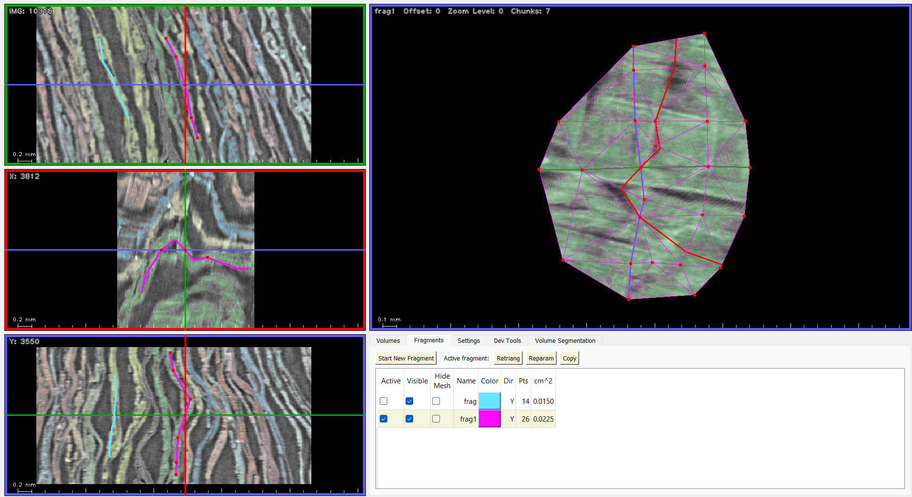

# Viewing color overlays in khartes

This document describes a method of overlaying colored
information (indicators or detected ink) on top of the
scroll data viewed in khartes.

This method, which relies on special scripts and
a hacky data format, is intended to be temporary, and should eventually
be replaced by an overlay method that is entirely internal
to khartes and does not
rely on scripts.

## Overview

At the bottom of this file, I describe the modified data format,
in case you want to create your own RGB 3D data set to
be viewed in khartes.

However, if you already have scroll data and indicator data
in certain format (3D TIFF files, or labeled-instance NRRD files), 
you can use the scripts
that I describe in the next sections to overlay colored data
on top of scroll data.

## Creating an overlay file from labeled-instance NRRD files

The process of creating a volume with overlays,
from labeled-instance NRRD files, has a couple of steps:

0) It is assumed that you have NRRD files of the
type found, for example, in
https://dl.ash2txt.org/full-scrolls/Scroll1/PHercParis4.volpkg/seg-volumetric-labels/instance-annotated-cubes-harmonized-labels/
and that these files (including mask files and volume files) are
all stored in a single directory.

1) Use the `inst_ann.py` script to create a khartes-format NRRD file
from these mask and volume file.

2) Load the NRRD file into khartes, and view it.

### `inst_ann.py`

The `inst_ann.py` script reads all of the labeled-instance NRRD files,
known as mask and volume files, that are in a given directory. 

It create an NRRD file that can be displayed in khartes, with the
colored indicators overlaid on the scroll data.

This script take two mandatory arguments:

1) The name of the directory that contains the mask and volume files.
**Important note:** The output volume will be created to be
large enough to encompass all the given input volumes.  If the
input volumes are scattered in various parts of the scroll,
then the output volume could be huge in order
to encompass them all.  So make sure the input files
describe a relatively compact volume.

2) The name of the output NRRD file that will contain the scroll
data, overlaid by the label colors.

There is also one optional argument:

`--alpha` sets the transparency of the overlay.  A value of 0.0
means completely transparent; 1.0 means completely opaque.
The default value is 0.25.

### `khartes.py`

Once you have created the NRRD file, you can load it
into the latest version of khartes (currently the
khartes3d-beta branch) and (if all goes well)
see the label colors overlaid on the scroll data.

## Creating an overlay file from 3D TIFF files

The process of creating a volume with overlays, from 3D TIFF
files, has several steps:

0) It is assumed that you alread have an indicator 
file (uint8 or uint16,
single channel) in 3D TIFF format.

1) Use the `ind_to_tif.py` script to create a uint8 RGBA file
(in 3D TIFF format)
from the indicator file.  This script gives each indicator
a color, according to a specified color map.

2) Use the `3dtif_to_nrrd.py` program to overlay the data
in the RGBA file from step 1 onto the scroll data, which
 assumed to be provided in a 3D TIFF file.
It is assumed
that the grids of the two files are aligned.  As its
name suggests, this script creates an NRRD file with
the headings that khartes expects.  Note that this NRRD
file contains uint16 data, but is encoded in a format that
can only be made sense of by the latest version of khartes.

3) Load the NRRD file into khartes, and view it.

### `ind_to_tif.py`

The `ind_to_tif.py` script reads an indicator file
(a file with an indicator number at each pixel),
and creates an RGBA (color) file, with the
indicator-to-color conversion based on a color map.

The script
takes two mandatory arguments:

1) The name of the indicator file.
It is assumed that the file contains indicators
in single-channel uint8 or uint16, in 3D TIFF format, 
and that a pixel value of `0` means that no indicator is present in
that pixel.

2) The name of the output file.  This will be a 
a 3D TIFF file, with each pixel represented by
4 channels (RGBA), each channel being a uint8.

There are also two optional arguments:

1) `--colormap`, which specifies the name of the colormap
used to convert indicator numbers to colors.  The
available colormaps are shown (and illustrated)
at https://cmap-docs.readthedocs.io/en/stable/catalog/ .
The default colormap is `bmr_3c`.

2) `--alpha`, which specifies the alpha (transparency)
to be stored in the A channel of the RGBA data.  The
allowed ranges are 0.0 (fully transparent) to
1.0 (fully opaque).  The default alpha value is 1.0
(opaque).

### `3d_tif_to_nrrd.py`

The `3d_tif_to_nrrd.py` script reads a 3D TIFF file and
creates a NRRD file containing the headers that
khartes expects.

Optionally, it also can read the 3D TIFF RGBA file
created by `ind_to_tif.py`, and overlay the colors
in that file on top of the gray-scale scroll data.
The RGB channels in this file specify the overly color, 
and the A channel specifies the alpha (opacity) of the overlay color.

In order to store colors in the output gray-scale
file (which is a single-channel
uint16 khartes-compatible NRRD file), color information
is encoded in a special format that the latest version
of khartes knows how to interpret.

`3d_tif_to_nrrd.py` takes two mandatory arguments:

1) The name of the 3D TIFF file that contains the
scroll data, in uint8 or uint16 format.

2) The name of the NRRD file that will be created,
which will contain the scroll data and, optionally,
a color overlay of the indicator data.

There are also two optional arguments:

1) `--overlay`, which specifies the name of the overlay
file (previously created by `ind_to_tif.py`), which contains
uint8 RGBA data in 3D TIFF form.  It is assumed that the
3D grid of the overlay file has exactly the same
size, and is in exactly the same xyz position, as the 
3D grid of the scroll data file.

2) `--alpha`, which specifies an alpha value
that will be applied to the overlay data, overriding the
value in the A channel of the RGBA file specified
by the `--overlay` argument.  Alpha can range from
0.0 (transparent) to 1.0 (opaque).  The default
value is `None`, which means that the alpha value
will be taken from the A channel of the overlay
file.

### `khartes.py`

Once you have created the NRRD file, you can load it
into the latest version of khartes (currently the
khartes3d-beta branch) and (if all goes well)
see the indicator colors overlaid on the scroll data.

## Creating a 3D RGB file to be viewed in khartes.

In this section, I describe the format used by khartes
to encode RGB data in a single-channel uint16 file.

Eventually, khartes will be updated to read conventional
multi-channel RGB or RGBA files, and at that time khartes
will also be able to overlay colored data on
top of the scroll data, without requiring all of the
scripts described above.

However, such a change will require updating the entire
graphics pipeline used by khartes.

In the meantime, this document describes a hacky way of
viewing RGB data in khartes, using an encoding that compacts
RGB data into a single uint16 word.

This method relies on the fact that khartes can read volume
data in NRRD format, which consists of header information followed
by raw data.  The headers required by khartes can be seen,
for example, at the bottom of the `inst_ann.py` script.

The header `khartes_uses_overlay_colormap` specifies whether
the raw data is in normal uint16 grayscale (when the header
is set to `False`, or the header is absent),
or whether the data is in the more complicated
format described below (when the header is set to `True`)

### The uint16 RGB format

In order to encode RGB information into a single uint16 word,
a special format is used.

First, some terminology.  The 16 bits of the uint16 word are
numbered from 0 (least-significant bit) to 15 (most significant bit).

In this format, bit 15 is used as a flag.

If bit 15 is set to 0, then the remaining bits (0 through 14) are
considered to carry grayscale values, where the minimum possible
value (0) encodes black, and the maximum possible value (32767)
encodes white.

If bit 15 is set to 1, then the remaining bits encode RGB
values.  Bits 10 through 14 encode the red value (the value 0 
represents no red and 31 represents full red), 
bits 5 through 9 encode the green
value (value range 0 through 31), and bits 0 through 4 encode
the blue value (again, the range of possible values is 0 through 31).

Note that this format only defines the gray scales and RGB values
to be displayed.
It is up to the script that creates a file in this format to
compute and set the RGB values that
correspond to a transparent overlay color
on top of gray scale scroll data, and to set pure gray scale values
in areas of the scroll data that have no overlays.
