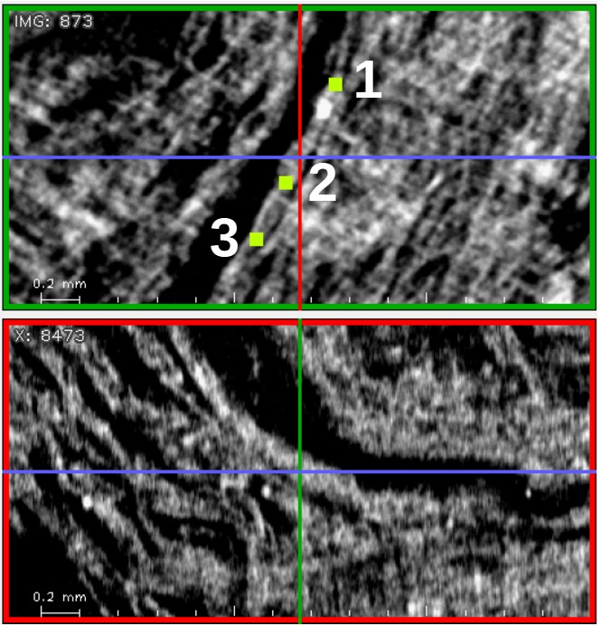
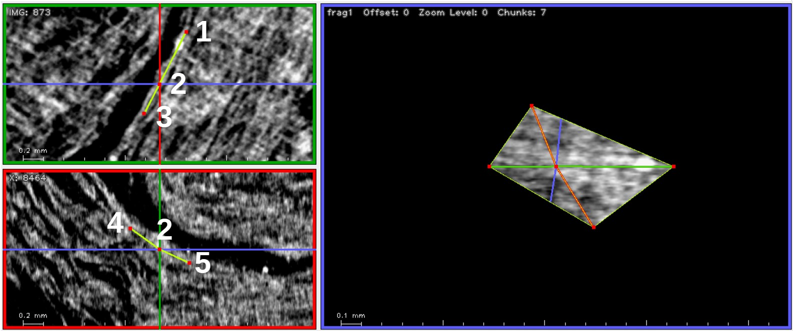
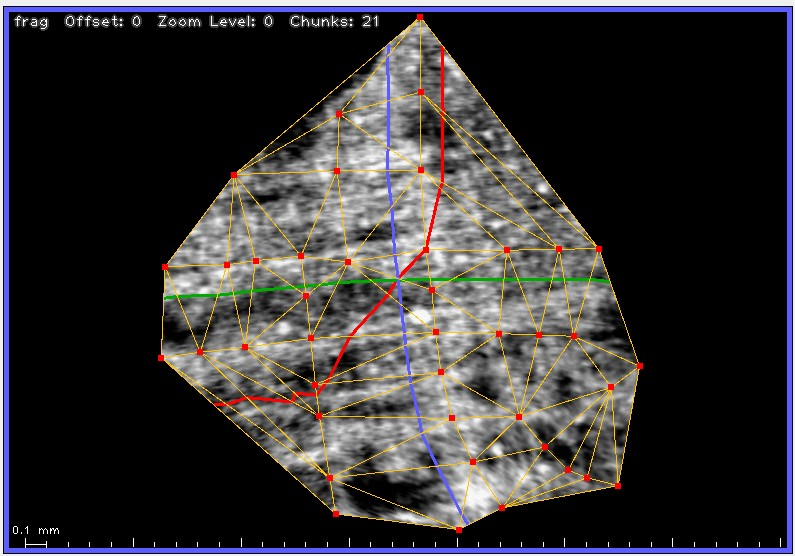

# Getting started with khartes3d

Using khartes3d is a lot like using khartes,
but there are a couple of differences to keep in mind.

The main difference is in how you start a new fragment.

It is important that you place the first 5 points
in a certain way.

0) Make sure you have pressed the `New Fragment` button.

1) The first 3 points should be placed in the upper-left
window (the `IMG` window, with a green frame), 
in clockwise order around the
center of the scroll.  Khartes draws these points in a larger
size, to emphasize that they are the starting points.

2) Place the cursor over the middle point (point 2), and
hit the `x` key.  This will center point 2 in all 3 windows.

3) In either the `X` window or the `Y` window (whichever seems to
provide a clearer view) place the final 2 points (points 4 and 5)
on opposite sides of point 2.
The order does not matter.  Note that the surface now appears in
the map view, and the points are redrawn in a normal size.

That's it!

From there, proceed as you would before.  
As with the 2D version of khartes,
try to maintain a sort of squarish layout in map view.  Try to
avoid long skinny triangles.

## Beginner tips

1) In the current version, when khartes starts, the windows will
all be a shade of dark red.  Once a project is loaded (or a new
project is created), the windows will have their customary
black background.

2) In the data-slice views, make sure that the
segment line (the line that represents the cross section
of the segment) is close to the cross hairs.  If you move
the segment line too far from the cross hairs, 
**the map view goes blank!**  If this happens, just move
the segment line back close to the cross hairs.

3) Save regularly!

4) Turn on the tracking cursor (press the `t` key to 
toggle the tracking cursor on and off).

5) In the map view, look at the 3 axes (green, red, blue)
to decide which data slice to add points to.  I tend to
add points in the green window (the IMG window) and in
the window corresponding to whichever axis is most perpendicular
to the green axis.  (In the picture above, the blue axis fits
this criterion).

## Advanced tips

Once you have placed a hundred or so points, you are
ready for some advanced topics.

### Reparameterization

I won't go into detail here (see the Algorithm section below if
you want to go deeper), but you should be aware that every
point, besides carrying its xyz location, carries two
parameters: u and v.  These parameters are used to determine
where to draw the points in the map view (fragment view).

Every time you change the surface, by adding, deleting, or
moving a point, the parameters of all the points need to be
recalculated.

This recalculation of the parameters is called **reparameterization**.

Reparameterization of a large surface (one with several thousand
points) can be time consuming, and the user would find it annoying
to wait for this to take place every time they moved or added a
point.

So to speed things up, the parameters are recalculated only for
the 100-200 points that are closest to the point that the user just
modified.

This works pretty well, but over time, distortions can build up,
so it is necessary now and then to reparameterize the entire surface.
This is done when the user presses the `Reparameterize` button in
the Fragment control panel (the panel that shows the list of surfaces).

Once your surface has more than 100 points or so, I recommend pressing
the `Reparameterize` button whenever you have added one or two
dozen points.
Out of habit, I always save the project just before I press the 
`Reparameterize` button.

### Big-triangle molasses

Sometimes, when your surface has an embayment, 
the embayment is filled by a large triangle.
(Need a picture of this).

As you add points on the data slices, 
in an attempt to fill in
the triangle, you might see something strange:  Intead of going
all the way across the triangle, the points seem, in
the map view, to get bogged
down inside of the triangle.
(Need a picture to illustrate this).

The fundamental problem is that in areas where the
surface has high curvature, large triangles create
serious distortions in the parameterization.  This
distortion in turn causes new points to be placed incorrectly
in the map view.

One way to fix this (not sure if it always works):

1) Delete the bogged-down points (hopefully there are only 2-3 of these).

2) In the **map view**, add a new point at the outside edge of the triangle.

3) Move the cursor on top of the new point, and type `x` on the keyboard
to recenter it.

4) In one of the data-slice windows, move the point to its correct
location.

(Need to provide more pictures)

## Algorithm (optional reading)

This section describes the algorithm that is used to create 
surfaces in khartes3d.
You do not need to read this section (or understand the algorithm)
in order to use khartes3d.
The information is provided here only
in case you are interested.

### Short version

Create the surface incrementally: start with a very small surface and
add points points to it one at a time.  This is a much more tractable
problem than trying to create an entire surface from a large cloud of
points.

### Very long version

Let's start with the basics.  
A triangulated surface, at least in the
context of khartes3d (and vc_render) carries three pieces of
information.

1) Each point of the surface has xyz coordinates, the position of the
point in 3D space.

2) Each point of the surface has uv coordinates.  These give the
position of the point in a map view.  These are often referred to as
texture coordinates or texture parameters. 

3) The surface also has a triangulation.  This is a list of triangles;
each triangle in the list is specified by the three points that make
up its vertices.

So in summary, the surface is specified by the xyz coordinates and uv
coordinates of its points, and by the list of the triangles that are
formed by the points.

If your surface is missing some of this information, you might be able
to generate it.

For instance, if your points have xyz values, and the surface has a
triangulation, but the points are missing their uv values, you can use
an algorithm known as "flattening" or "mesh parameterization" to
calculate the uvs.  Well-known algorithms of this type include LSCM,
ABF++, and SLIM.  Each of these algorithms will produce a somewhat
different answer, that is, different uv values.  In the case of LSCM,
the results will also vary depending on which pair of points are
chosen as the initial constraints.

If the points of your surface have xyz and uv values, but your suface
is missing its triangulation, you can create one.  First, plot all the
points on the uv plane.  This shows you your points in map view.  Then
use Delaunay triangulation to create a list of triangles.  The
thing to watch out for here is that the Delaunay algorithm will
triangulate the convex hull of the set of points.  This means that if
your point set contains concavities (embayments), which it probably
does, these concavities will be filled by spurious triangles.  These
spurious triangles can create problems later on.

If you only know the xyz coordinates of your points, with no uv values
and no triangulation, you have what is known as a "point cloud".
Creating a triangulation from a point-cloud is a well-studied topic,
but there does not appear to be a reliable solution to the
specific problem
that we have, where the point cloud is created from a surface that may
wrap numerous times around a central core.  In any case, this topic
will not be discussed further here, since khartes3d does not attempt
to solve the problem of creating an entire surface from a cloud of
points.

An interesting question, and one that is very relevant to khartes3d,
is whether the first two processes just mentioned, parameterization
and triangulation, can be applied sequentially, and multiple times.

For instance, suppose you have a fully-described surface (one with
xyzs, uvs, and a triangulation).  

Now, throw away the triangulation, and re-triangulate using Delaunay,
as described above.

Now throw away the uv values, and re-parameterize using one of the
above parameterization algorithms (ABF++, say).  Once you have done
this, only the xyz coordinates retain their original values; the uvs
and triangulations have both been recalculated.

Now do the same two steps again: re-triangulate, then re-parameterize.
And again.

The question, which I don't know the answer to, is what happens when
you keep doing these steps over and over.  Do instabilities develop,
eventually destroying the coherence of the surface?  Do the values
eventually converge?  In practice, on the surfaces I have tested,
instabilities do not seem to develop.  But I don't know whether I have
just been lucky in my choice of surfaces.  The old saying, "It may
work in practice, but it will never work in theory", applies here.

The reason why this question is relevant will be obvious once I
describe the algorithm that khartes3d uses to grow surfaces.

**So here is the incremental algorithm that khartes3d uses:**

Suppose you have an existing surface, one that is fully described
(that is, with xyzs, uvs, and a triangulation).  

Now the user creates a new point near, but not on, this surface.  When
creating this new point, the user specifies only its xyz coordinates.

It is not difficult to roughly compute the new point's uv coordinates:
find the existing triangle (in xyz space) that is nearest to the new
point, and then extrapolate that triangle's uv values (using
barycentric extrapolation, for instance) to find the approximate uv
coordinates of the new point.

Then, use the uv values of all the points, including the new point, to
create a new triangulation.  Re-parameterize, based on this new
triangulation, in order to get a more refined uv value for the new
point.

The result is a fully described surface that incorporates the point
that the user just added.

Thus, every time a point is added, the surface goes through a cycle of
re-triangulation and re-parameterization.

In practice, this seems to work.

I've left out a number of practical details, including how to
eliminate spurious convex-hull triangles (they cause distortions in
the parameterization process), and how to perform incremental updates
(the full re-parameterization of a large surface can take several
minutes).

Anyway, that is the general description of the algorithm.

