# Getting started with khartes3d

Using khartes3d is a lot like using khartes,
but there are a couple of differences to keep in mind.

The main difference is in how you start a new fragment.

It is important that you place the first 5 points
in a certain way.

0) Make sure you have pressed the `New Fragment` button.

1) The first 3 points should be placed in the upper-left
window (the `IMG` window, with a green frame), 
in clockwise order around the
center of the scroll.  Khartes draws these points in a larger
size, to emphasize that they are the starting points.

2) Place the cursor over the middle point (point 2), and
hit the `x` key.  This will center point 2 in all 3 windows.

3) In either the `X` window or the `Y` window (whichever seems to
provide a clearer view) place the final 2 points (points 4 and 5)
on opposite sides of point 2.
The order does not matter.  Note that the surface now appears in
the map view, and the points are redrawn in a normal size.

That's it!

From there, proceed as you would before.  
As with the 2D version of khartes,
try to maintain a sort of squarish layout in map view.  Try to
avoid long skinny triangles.

## Beginner tips

1) In the current version, when khartes starts, the windows will
all be a shade of dark red.  Once a project is loaded (or a new
project is created), the windows will have their customary
black background.

2) In the data-slice views, make sure that the
segment line (the line that represents the cross section
of the segment) is close to the cross hairs.  If you move
the segment line too far from the cross hairs, 
**the map view goes blank!**  If this happens, just move
the segment line back close to the cross hairs.

3) Save regularly!

4) Turn on the tracking cursor (press the `t` key to 
toggle the tracking cursor on and off).

5) In the map view, look at the 3 axes (green, red, blue)
to decide which data slice to add points to.  I tend to
add points in the green window (the IMG window) and in
the window corresponding to whichever axis is most perpendicular
to the green axis.  (In the picture above, the blue axis fits
this criterion).

## Advanced tips

Once you have placed a hundred or so points, you are
ready for some advanced topics.

### Reparameterization

I won't go into detail here (see the Algorithm section below if
you want to go deeper), but you should be aware that every
point, besides carrying its xyz location, carries two
parameters: u and v.  These parameters are used to determine
where to draw the points in the map view (fragment view).

Every time you change the surface, by adding, deleting, or
moving a point, the parameters of all the points need to be
recalculated.

This recalculation of the parameters is called **reparameterization**.

Reparameterization of a large surface (one with several thousand
points) can be time consuming, and the user would find it annoying
to wait for this to take place every time they moved or added a
point.

So to speed things up, the parameters are recalculated only for
the 100-200 points that are closest to the point that the user just
modified.

This works pretty well, but over time, distortions can build up,
so it is necessary now and then to reparameterize the entire surface.
This is done when the user presses the `Reparameterize` button in
the Fragment control panel (the panel that shows the list of surfaces).

Once your surface has more than 100 points or so, I recommend pressing
the `Reparameterize` button whenever you have added one or two
dozen points.
Out of habit, I always save the project just before I press the 
`Reparameterize` button.

### Big-triangle trouble

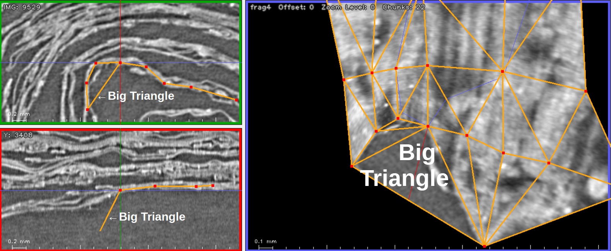

Sometimes, when your surface has an embayment, 
the embayment is filled by a large triangle,
as in the screenshot above.

The Fragment View (on the right) shows the big triangle
in map view.  On the two Data Slices on
the left (I've omitted the third
Data Slice,
since it doesn't add anything)
I've indicated the cross section lines created by
this large triangle.

This triangle really should not exist at
all.  However, reliably removing this sort of 
triangle, without accidently removing legitimate
triangles, is a technical challenge, so pending
further improvements, these triangles will be
present for now.

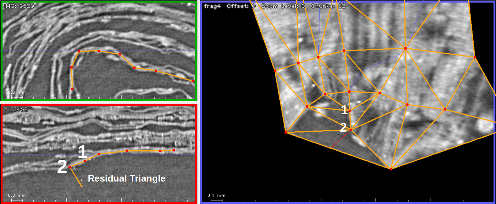

As you add points on the data slices, 
in an attempt to fill in
the triangle, you might see something strange:  Intead of going
all the way across the triangle, the points seem, in
the Fragment View, to get bogged
down inside of the triangle.

This "bogging down" tends to happen in regions where
the segment curves sharply.

In the screenshot above, the user has added two points (`1` and `2`) 
by clicking in
the red-framed Data Slice, as indicated by the large numbers.
I've indicated the same points in the Fragment View, but in
a smaller font, to emphasize that although the points are visible
in the Fragment View, that is not where the user worked when
adding them.

Notice, in the lower Data Slice, how the cross section of the
residual triangle heads off at a sharp angle.

If you compare the Fragment View in the screenshot above, with
the Fragment View in the screenshot above that, you can see how
the unlabelled point in the bottom middle has actually 
contracted inwards; this is the most obvious sign of
distortion that has occurred because of the addition of the new points.

The fundamental problem is that in areas where the
surface has high curvature, large triangles create
serious distortions in the parameterization.  This
distortion in turn causes new points to be placed incorrectly
in the map view, and as these points are added, existing points 
shift in a way that
creates distortions in the image.

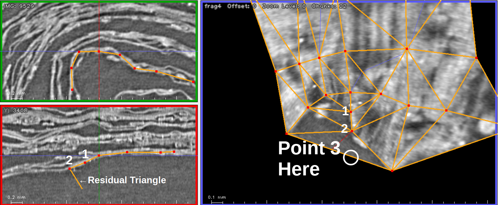

Sometimes, if you just keep going, adding more points to the
Data Slice, the problem corrects itself.

Sometimes it doesn't.

The screenshot above shows
an alternative way to deal with persistent large triangles.

The main idea: instead of adding yet another point to
one of the Data Slices, add a point (point `3` in
this case) to the edge of the big
triangle, in the **Fragment View**.

The advantage to this approach: It breaks up the big triangle.

The disadvantage: The new point you create is not on the
segment, you need to move it into place.

The screenshots below illustrate this process.

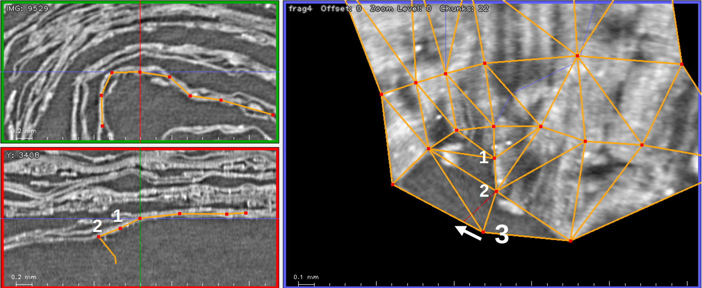

The screenshot above shows the result of adding point `3`
to the edge of the big triangle.

Although it isn't required, I like to move the new point
onto one of the colored crosshairs (red in this case), so
that it will be visible in one of the current Data Slices.

The white arrow indicates that I plan to move point `3` to
the left, in the Fragment View, so that it is on the red crosshair.

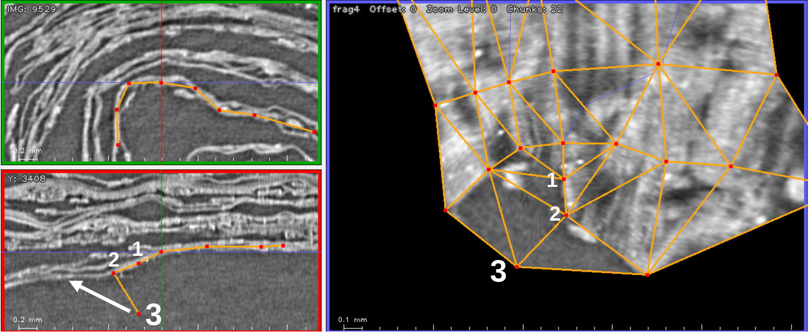

The screenshot above shows the results of moving point `3`
onto the red crosshair.  This movement makes the point visible
in the red-framed Data Slice.  Point `3` is still far from
the correct location; the white arrow shows the direction in which it
should be moved.

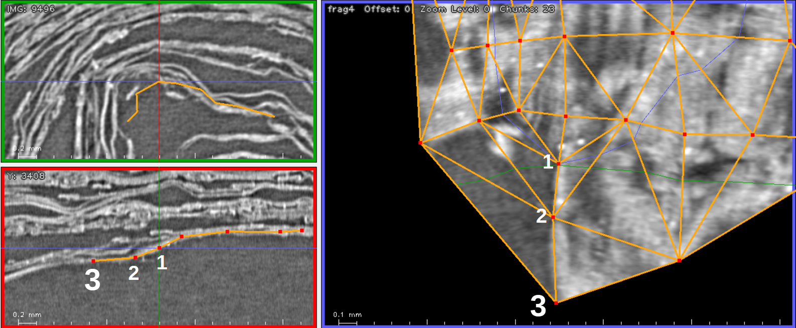

And at last, this screenshot shows the final result of
moving point `3` onto the segment.
The process was a bit complicated, but it gave a good result.

Notice, by the way, that there are still some large triangles
to the left, which the green crosshair passes through.
Will simply adding points to the segment in the green-framed
Data Slice be sufficient?  Or will we need to click on
the outside edge of the largest triangle?  We won't know until
we try...

**And a reminder once again:** when the surface begins behaving
strangely, you can often fix the problem
by pressing the `Reparam` button
(after saving first)

### Viewing the segment in 3D

One easy way to see what your segment looks like in 3D
is to export it as a `.obj` file and load it into 
the program `MeshLab`.

It has long been possible to export such a file from khartes,
using the `File / Export fragment as mesh...` command.
However, in khartes3d, this command exports not only the shape
of the segment, but the data on the segment as well.

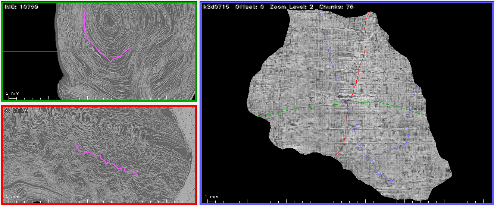

For instance, this screenshot shows a typical segment in khartes3d.

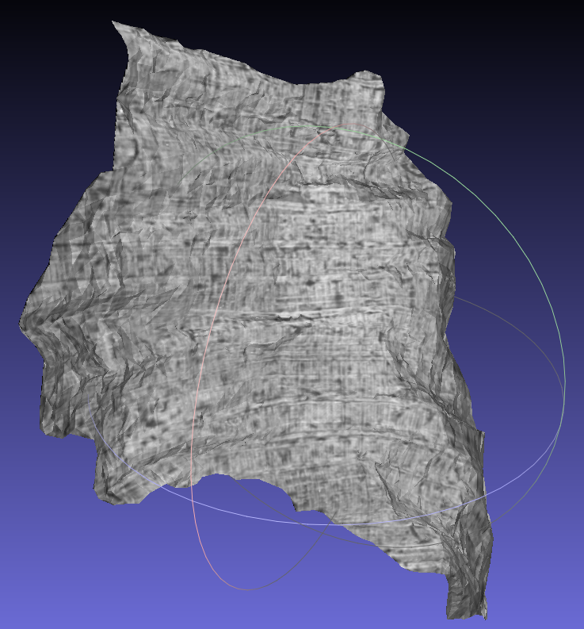

And this screenshot shows the result of exporting this mesh
and viewing it in MeshLab.

The thing to be aware of is that the pixel data that is projected
onto the mesh is not the highest possible resolution (unlike, say,
`vc_render`, which exports high-resolution pixels).
Instead, the pixel resolution is exactly the same as 
that of the image you see
in the Fragment View in khartes.

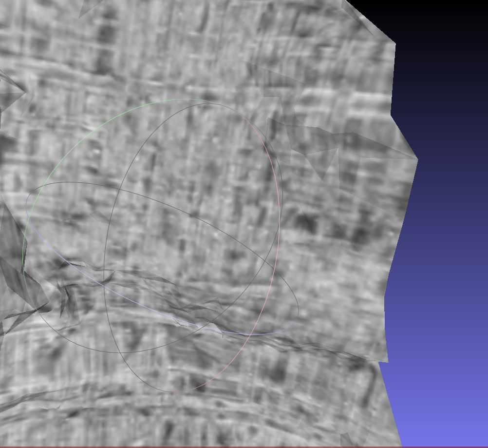

When you zoom into the surface in MeshLab, the low resolution becomes obvious.

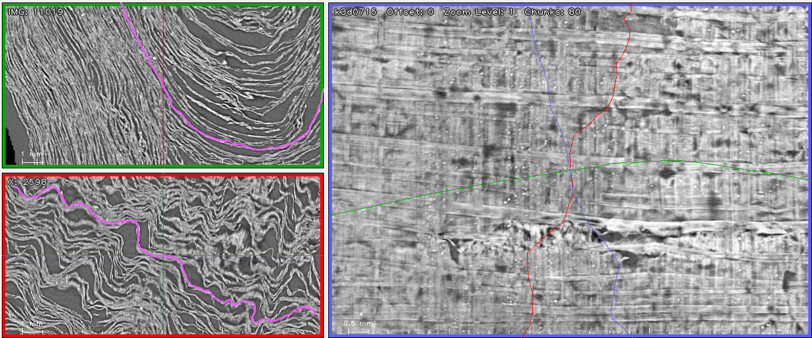

If you want to see the data in 3D at a higher resolution,
you need to zoom into the segment, as above, before
exporting the mesh.

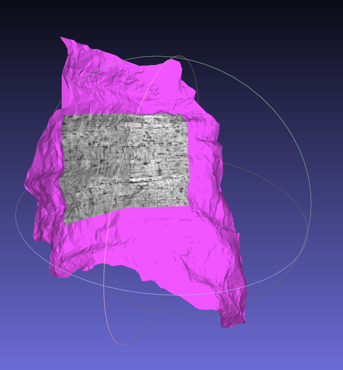

However, as before, the only data shown on the surface in MeshLab
is the data that is visible in the Fragment View.

This is a significant limitation, but exporting a full high-resolution
image would take much longer, because of the additional computations
that would be required
and the additional data that would need to be loaded.

## Algorithm (optional reading)

This section describes the algorithm that is used to create 
surfaces in khartes3d.
You do not need to read this section (or understand the algorithm)
in order to use khartes3d.
The information is provided here only
in case you are interested.

### Short version

Create the surface incrementally: start with a very small surface and
add points points to it one at a time.  This is a much more tractable
problem than trying to create an entire surface from a large cloud of
points.

### Very long version

Let's start with the basics.  
A triangulated surface, at least in the
context of khartes3d (and vc_render) carries three pieces of
information.

1) Each point of the surface has xyz coordinates, the position of the
point in 3D space.

2) Each point of the surface has uv coordinates.  These give the
position of the point in a map view.  These are often referred to as
texture coordinates or texture parameters. 

3) The surface also has a triangulation.  This is a list of triangles;
each triangle in the list is specified by the three points that make
up its vertices.

So in summary, the surface is specified by the xyz coordinates and uv
coordinates of its points, and by the list of the triangles that are
formed by the points.

If your surface is missing some of this information, you might be able
to generate it.

For instance, if your points have xyz values, and the surface has a
triangulation, but the points are missing their uv values, you can use
an algorithm known as "flattening" or "mesh parameterization" to
calculate the uvs.  Well-known algorithms of this type include LSCM,
ABF++, and SLIM.  Each of these algorithms will produce a somewhat
different answer, that is, different uv values.  In the case of LSCM,
the results will also vary depending on which pair of points are
chosen as the initial constraints.

If the points of your surface have xyz and uv values, but your suface
is missing its triangulation, you can create one.  First, plot all the
points on the uv plane.  This shows you your points in map view.  Then
use Delaunay triangulation to create a list of triangles.  The
thing to watch out for here is that the Delaunay algorithm will
triangulate the convex hull of the set of points.  This means that if
your point set contains concavities (embayments), which it probably
does, these concavities will be filled by spurious triangles.  These
spurious triangles can create problems later on.

If you only know the xyz coordinates of your points, with no uv values
and no triangulation, you have what is known as a "point cloud".
Creating a triangulation from a point-cloud is a well-studied topic,
but there does not appear to be a reliable solution to the
specific problem
that we have, where the point cloud is created from a surface that may
wrap numerous times around a central core.  In any case, this topic
will not be discussed further here, since khartes3d does not attempt
to solve the problem of creating an entire surface from a cloud of
points.

An interesting question, and one that is very relevant to khartes3d,
is whether the first two processes just mentioned, parameterization
and triangulation, can be applied sequentially, and multiple times.

For instance, suppose you have a fully-described surface (one with
xyzs, uvs, and a triangulation).  

Now, throw away the triangulation, and re-triangulate using Delaunay,
as described above.

Now throw away the uv values, and re-parameterize using one of the
above parameterization algorithms (ABF++, say).  Once you have done
this, only the xyz coordinates retain their original values; the uvs
and triangulations have both been recalculated.

Now do the same two steps again: re-triangulate, then re-parameterize.
And again.

The question, which I don't know the answer to, is what happens when
you keep doing these steps over and over.  Do instabilities develop,
eventually destroying the coherence of the surface?  Do the values
eventually converge?  In practice, on the surfaces I have tested,
instabilities do not seem to develop.  But I don't know whether I have
just been lucky in my choice of surfaces.  The old saying, "It may
work in practice, but it will never work in theory", applies here.

The reason why this question is relevant will be obvious once I
describe the algorithm that khartes3d uses to grow surfaces.

**So here is the incremental algorithm that khartes3d uses:**

Suppose you have an existing surface, one that is fully described
(that is, with xyzs, uvs, and a triangulation).  

Now the user creates a new point near, but not on, this surface.  When
creating this new point, the user specifies only its xyz coordinates.

It is not difficult to roughly compute the new point's uv coordinates:
find the existing triangle (in xyz space) that is nearest to the new
point, and then extrapolate that triangle's uv values (using
barycentric extrapolation, for instance) to find the approximate uv
coordinates of the new point.

Then, use the uv values of all the points, including the new point, to
create a new triangulation.  Re-parameterize, based on this new
triangulation, in order to get a more refined uv value for the new
point.

The result is a fully described surface that incorporates the point
that the user just added.

Thus, every time a point is added, the surface goes through a cycle of
re-triangulation and re-parameterization.

In practice, this seems to work.

I've left out a number of practical details, including how to
eliminate spurious convex-hull triangles (they cause distortions in
the parameterization process), and how to perform incremental updates
(the full re-parameterization of a large surface can take several
minutes).

Anyway, that is the general description of the algorithm.

## Adding points to a multi-wrap segment (optional reading)

When the user clicks on a Data Slice to add a point to a segment,
and the segment has multiple wraps,
khartes must decide which wrap to add the point to.

This is an informal discussion of how khartes does that; I wrote it
to explain the process to a user.

Most people will not be interested in this niche topic,
but if you are, keep reading!

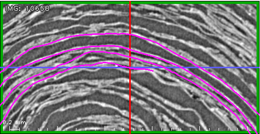

Khartes does not keep track of wraps; it doesn't even have the
concept.  But I'll tell you some of what is happening behind the
scenes in khartes, since you may be interested.

So imagine you have a data slice where several wraps are visible.  You
want to add a point off the end of one of the wraps, so you click at a
location on the data slice.  How does khartes know where to attach the
new point that is created at that location? 

First of all, khartes at this stage is not thinking about
"attachment", it is trying to solve a different problem: your click
has specified a point location in xyz space (scroll data coordinates);
what are the uv coordinates (map/fragment view coordinates) of that
newly created point?  (Once it has figured out the uv coordinates, it
can add the point to the map view and retriangulate, thus "attaching"
the point to the surface, but we haven't reached that stage yet). 

To figure out the new uv location, khartes looks at the information
that is visible in the data slice where you clicked.  Specifically, it
looks at the cross-section lines that are visible.  Or more precisely,
it looks at all the colored pixels (the pixels that are colored
because they compose the cross-section line).  Each colored pixel
carries
certain information: the surface triangle that generated the pixel, 
the pixel's xyz location, and the pixel's uv location.

So at this point khartes has the xyz location of the new point you
created, and it has a list of the xyz locations of all the colored
pixels (the surface cross section).

The next step (which I will describe in much greater detail in a
minute, because it is more complicated than it first appears) is to
find the nearest colored pixel to the new point that the user has
created.  Given the information carried by that nearby colored pixel,
it is possible to compute an approximate uv location for the
newly-created point, which is the problem we set out to solve.
Hooray!

But...

If multiple wraps are visible on the data slice, how to choose the
"correct" one, that is, the one that the user intended?  In many
cases, the pixels of one of the other wraps may be closer, in xyz
space, to the new point, that is, closer than the pixels of the wrap
that the user actually has in mind.

Bear in mind that at this point, khartes does not know anything about
wraps; at this point khartes only has a list of colored pixels, with
each pixel carrying only triangle id, xyz, and uv.

So to choose the closest pixel, khartes actually has to go through a
two-step process.  First, eliminate the pixels on the wrong wrap
(except, khartes doesn't know about wraps!), and second, choose the
closest pixel of the ones that weren't eliminated in the first step.

Khartes doesn't know anything about wraps, but it does have a couple
of handy pieces of information.  One: it knows the uv location of each
pixel.  Second: it knows the uv location of where the user is working.
This second piece of information is given by the uv location of the
cross hairs in map view.  The assumption is that the user is most
interested in the area near the cross hairs.

So in the first step of the two-step process above, the
eliminate-the-wrong-wrap process, khartes looks at the uv location of
each colored pixel, and decides if it is "close enough" to the work
area (the map-view crosshairs).  If it is close enough, the pixel is
kept, otherwise it is not.  And as mentioned above, only the pixels
that survive this screening are passed on to the "closest pixel in xyz
to the new point" test.

The test for "close enough" in uv space is
based on the size of the Data Slice window and the 
zoom factor.  If you are zoomed out so far that you
see the entire loop around the center, it is possible
that this algorithm will not do a good job.

In other words, the more zoomed-in your view in the Data Slice
window, the more likely that khartes will select the correct
wrap.
